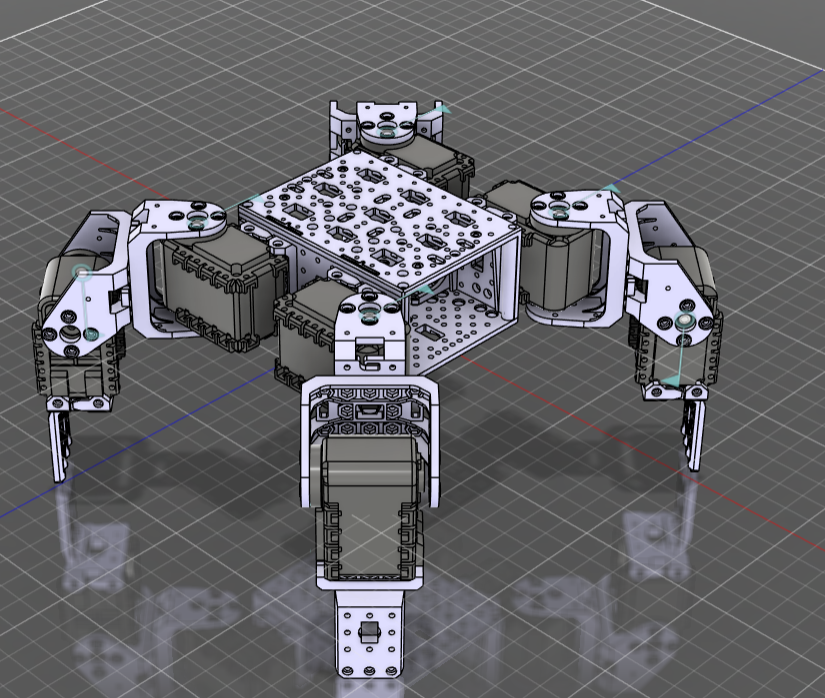

# Bioloid Quadruped Reinforcement Learning (HRL)

This repository implements a high-performance **Hierarchical Reinforcement Learning (HRL)** framework for a Bioloid 8-DoF quadruped robot. The project now fully supports both the **PyBullet** and **MuJoCo** physics simulators, using highly optimized **Soft Actor-Critic (SAC)** policies to achieve stable locomotion primitives and goal-directed path navigation.

<div align="center">
  
</div>

---

## 📺 Demonstration Demos

Check out the trained hierarchical navigation policies running autonomously in both simulators:

### PyBullet Simulation

https://github.com/user-attachments/assets/9a17eb0d-86cd-44f0-bc0a-7b2675031882

### MuJoCo Simulation

https://github.com/user-attachments/assets/2ceeadc3-b5ab-4921-b7da-55081d9e0119


---

## ⚙️ System Architecture

The pipeline divides the complex control problem into two distinct abstraction layers:

1.  **Low-Level Skills (The "Body")**:
    *   Continuous **Soft Actor-Critic (SAC)** experts trained to mastery for individual motor primitives:
        *   **Walker (Forward Walking)**: Emerges a stable, high-speed 2Hz trot gait.
        *   **Turn Left / Turn Right**: Rotates the robot in-place.
    *   Accepts 28-dimensional proprioceptive states (joint positions/velocities, orientation, height, and touch sensors) and outputs joint torques.
2.  **High-Level Navigator (The "Brain")**:
    *   A **Discrete SAC** policy wrapping the expert motor skills.
    *   It observes the relative target waypoint (distance & angle) and decides *which* low-level behavior to execute (`WALK`, `TURN_LEFT`, `TURN_RIGHT`, `STOP`) every 0.5 seconds.
    *   This hierarchical structure improves sample efficiency by over 100x compared to standard monolithic learning.

---

## 📂 Project Structure

```
├── assets/                  # 3D robot models (URDFs for PyBullet, MJCF XML for MuJoCo, and STL meshes)
├── brains/                  # Policy architectures
│   └── sac/                 # Continuous & Discrete SAC agent implementations
├── envs/                    # Custom Gym environments
│   ├── pybullet/            # Base environments and Navigator wrapper for PyBullet
│   └── mujoco/              # Base environments and Navigator wrapper for MuJoCo
├── models/                  # Pre-trained policy checkpoints (Walker, Turners, and Point-Goal Navigator)
│   ├── pybullet/
│   └── mujoco/
├── scripts/                 # Human interaction and evaluation scripts
│   ├── teleop.py            # PyBullet keyboard control
│   ├── teleop_mujoco.py     # MuJoCo keyboard control
│   ├── evaluate_point_goal.py        # PyBullet hierarchical path evaluator
│   └── evaluate_point_goal_mujoco.py # MuJoCo hierarchical path evaluator
└── training/                # From-scratch training pipelines
    ├── pybullet/sac/        # PyBullet walker, turns, and goal navigation SAC pipelines
    └── mujoco/sac/          # MuJoCo walker, turns, and goal navigation SAC pipelines
```

---

## 🚀 Quick Start

### 1. Installation
Ensure you have Python 3.8+ installed, then clone this repository and install the dependencies:
```bash
pip install -r requirements.txt
```

### 2. PyBullet Simulation Execution
*   **Hierarchical Navigation (Autonomous):**
    ```bash
    python scripts/evaluate_point_goal.py
    ```
*   **Manual Keyboard Teleoperation:**
    ```bash
    python scripts/teleop.py
    ```
    *(Click the PyBullet GUI window to focus inputs. **UP Arrow**: Walk | **LEFT/RIGHT**: Turn | **R**: Reset)*

### 3. MuJoCo Simulation Execution
*   **Hierarchical Navigation (Autonomous):**
    ```bash
    python scripts/evaluate_point_goal_mujoco.py
    ```
*   **Manual Keyboard Teleoperation:**
    ```bash
    python scripts/teleop_mujoco.py
    ```
    *(A passive MuJoCo viewer will launch. Use **UP Arrow**: Walk | **LEFT/RIGHT**: Turn | **R**: Reset)*

---

## 🛠️ Training From Scratch

If you want to train your own locomotion primitives or navigation policies, execute the desired SAC training pipeline:

### In PyBullet:
*   Train Walk: `python training/pybullet/sac/train_walker.py`
*   Train Navigation: `python training/pybullet/sac/train_point_goal.py`

### In MuJoCo:
*   Train Walk: `python training/mujoco/sac/train_mujoco_walker.py`
*   Train Navigation: `python training/mujoco/sac/train_mujoco_navigation.py`

---

## ⚠️ Important Operational Notes

> [!IMPORTANT]
> **Locomotion Control Principles**:
> *   **Do not send overlapping command inputs** (e.g., trying to press Up and Left simultaneously during teleoperation). Primitives are distinct networks, and mixing commands directly causes high torque instability.
> *   **Avoid high-frequency command transitions**. Allow the robot to complete its current step cycle to maintain its dynamic center of mass before switching commands.

---

## 📄 License
This project is licensed under the MIT License.
